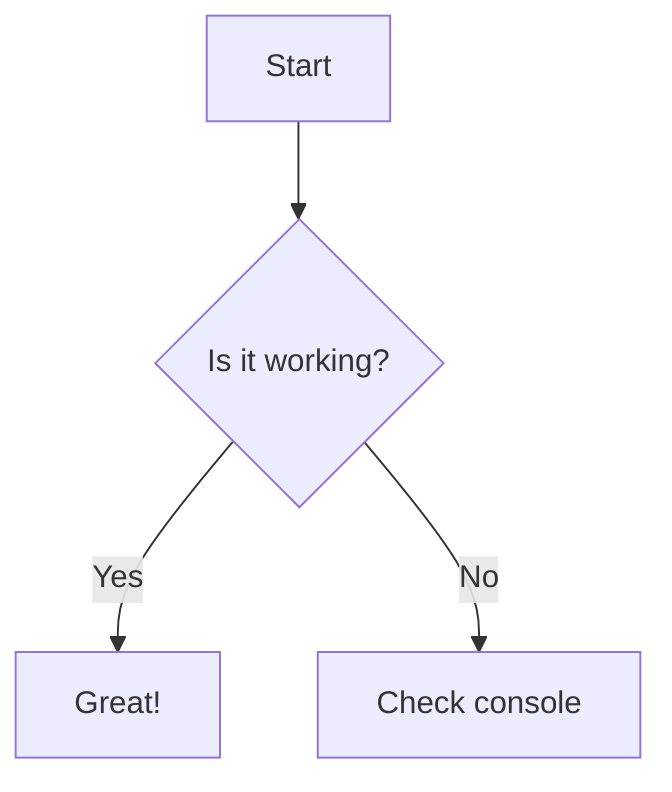

以下是一个流程图，在 GitHub 上的 preview 能够正常的渲染，我要试试在构建后的 jekyll（mmmistake 主题）是否能够正常的展示。

```mermaid
graph TD;
    A[Start] --> B{Is it working?};
    B -->|Yes| C[Great!];
    B -->|No| D[Check console];
```
