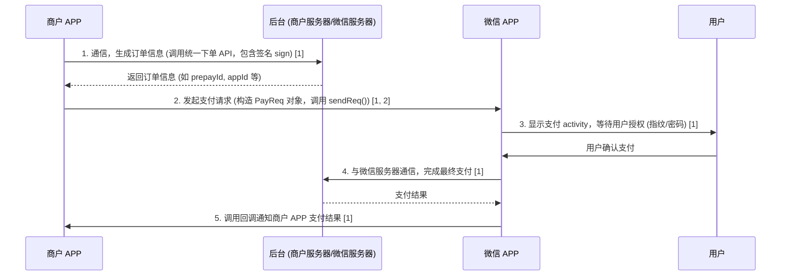

本文是对[《微信支付 Android SDK 逆向》](https://linhongbo.com/posts/wechat-android-sdk-reverse-engineering/)的学习笔记，简单的记录。

## 微信 APP 支付流程时序图



## 微信 APP 端接口认证逻辑图 (Flowchart)

```mermaid
graph TD
    subgraph 接口认证过程
    A[WXEntryActivity 接收商户 APP 发送的 Intent] --> B(提取商户 APP 包名 uN);
    B --> C{根据 appId 初始化 f 对象 (从服务端获取预注册的包名和签名)};
    C --> D{比较 待校验包名 uN 与 f.field_packageName 是否一致?};
    D -- 不一致 --> H((校验失败：非法应用));
    D -- 一致 --> E[使用 Android PackageManager API];
    E --> F[获取 uN (调用方) 对应的应用签名证书指纹];
    F --> G{比较 获取到的应用签名 与 f.field_signature 是否一致?};
    G -- 不一致 --> H;
    G -- 一致 --> I((校验成功：允许继续支付));
    style H fill:#fcc,stroke:#333,stroke-width:2px
    end

    style A fill:#DCDCDC
    style I fill:#ccf,stroke:#333,stroke-width:2px
```

** 图表说明：**  
微信支付的端侧接口认证是通过比较调用方传入的 appId、packageName，以及通过 Android 系统接口获取的调用方应用证书指纹（即「应用签名」）与服务器端预注册的值是否一致来实现的。

1. 微信客户端从 Intent 中提取商户 APP 的包名 uN。
2. 微信根据传入的 appId 构造 f 类对象，该对象包含了服务器预注册的包名和签名信息。
3. 首先校验调用方包名 uN 是否与预注册的包名 f.field_packageName 一致。
4. 随后，微信使用 PackageManager 接口，根据包名 uN 从操作系统中获取调用方的应用签名。
5. 最后，将获取到的签名与预注册的签名 f.field_signature 进行比较。
   只有这三项信息（appId、packageName、应用证书指纹）都与服务器预注册的值匹配，接口认证才算通过，从而防止非法应用接入。然而，文章指出，由于 appId 和 packageName 容易被客户端伪造，这导致了恶意 APP 仿冒合法应用发起支付的可能。
